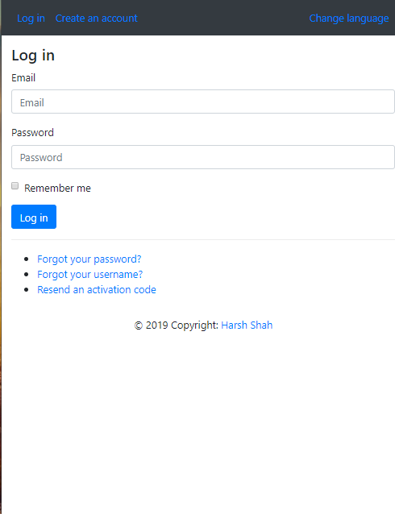

# Django Login and Registration

An example of Django project with  user functionalities.

## Screenshots

| Log In | Create an account | Authorized page |
| -------|--------------|-----------------|
|  |  |  |

| Password reset | Set new password | Password change |
| ---------------|------------------|-----------------|
|  |  |  |

## Functionality

- Log in
- Create an account
- Log out
- Profile activation via email
- Reset password
- Remind a username
- Resend an activation code
- Change password
- Change email
- Change profile


## Installing

### Clone the project

```
git clone https://github.com/harshhshah/djangologinregistration
cd djangologinregistration
```

### Install dependencies & activate virtualenv

```
pip install virtualenv
mkvirtualenv mygit(name of environment)
workon mygit
pip install -r requirements.txt
```

### Configure the settings (connection to the database, connection to an SMTP server, and other options)

1. Edit `/app/conf/development/settings.py` if you want to develop the project.

2. Edit `/app/conf/production/settings.py` if you want to run the project in production.

### Apply migrations

```
python manage.py migrate
```

### Running

#### A development server

Just run this command:

```
python source/manage.py runserver
```
And Enjoy!!
